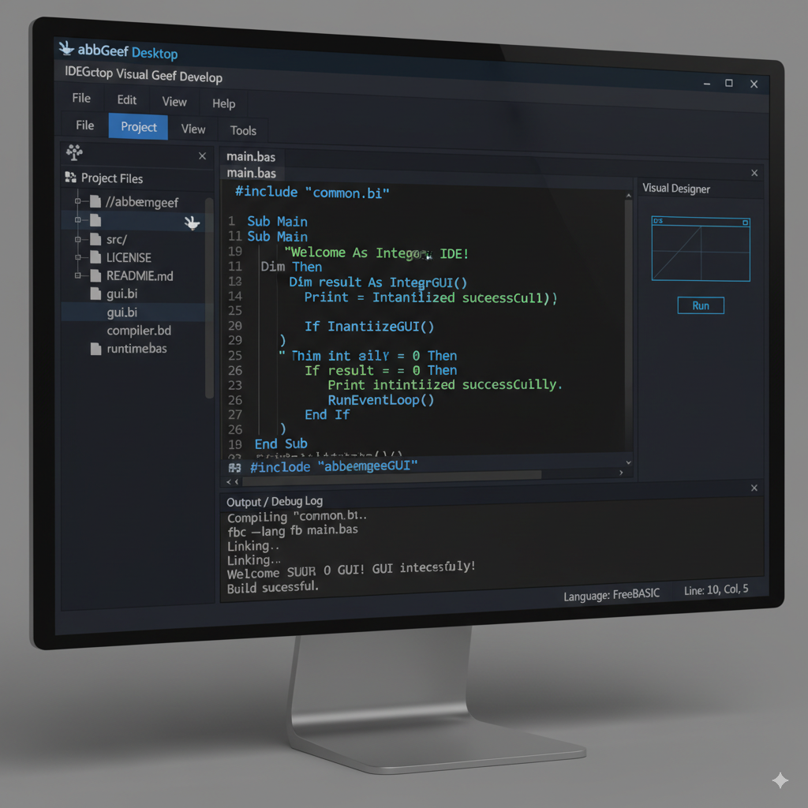

README.md for the "abbeemgeef" Project

# abbeemgeef

## Overview

This project, "abbeemgeef," is a desktop application developed using FreeBASIC. It is designed to provide visual tools and utilities for various development tasks. The core idea is to offer a user-friendly Integrated Development Environment (IDE)-like experience tailored for FreeBASIC development, allowing users to manage files, projects, and visually interact with their code.

## Features

*   **File Management:** Browse, open, and save FreeBASIC source files.
*   **Project Management:** Create, open, and manage FreeBASIC projects. This includes adding and removing files from a project.
*   **Visual Development Aids:**
    *   (Future) Simple GUI designer for FreeBASIC applications.
    *   (Future) Code editor with syntax highlighting for FreeBASIC.
    *   (Future) Basic debugging tools.
*   **Built with FreeBASIC:** The entire application is developed in FreeBASIC, making it lightweight and easily deployable on systems supporting FreeBASIC.

## Getting Started

### Prerequisites

To run and compile "abbeemgeef," you will need:

*   **FreeBASIC Compiler:** Download and install the FreeBASIC compiler suitable for your operating system.
*   **FBEdit (Optional, for development):** While "abbeemgeef" aims to be an IDE, FBEdit is a common IDE for FreeBASIC and might be useful for working on "abbeemgeef" itself.

### Compilation

1.  **Clone the Repository:**
    ```bash
    git clone https://github.com/your-username/abbeemgeef.git
    cd abbeemgeef
    ```
    (Note: Replace `https://github.com/your-username/abbeemgeef.git` with the actual repository URL if available).

2.  **Compile with FBC:**
    Open a terminal or command prompt in the project's root directory (`./abbeemgeef`) and execute the FreeBASIC compiler:
    ```bash
    fbc -lang fb abbeemgeef.bas
    ```
    This command assumes your main source file is `abbeemgeef.bas`. Adjust the filename if it's different.

### Running the Application

After successful compilation, an executable file (e.g., `abbeemgeef.exe` on Windows, `abbeemgeef` on Linux) will be created in the project directory. Run it from your terminal or by double-clicking.

```bash
./abbeemgeef
```

## Project Structure

The project directory (`./abbeemgeef`) is expected to contain the following:

*   `.bas` files: FreeBASIC source code files.
*   `.bi` files: FreeBASIC include files.
*   `README.md`: This file.
*   (Future) `assets/`: Directory for UI assets, icons, etc.
*   (Future) `docs/`: Documentation files.

## Contributing

Contributions are welcome! If you'd like to contribute, please:

1.  Fork the repository.
2.  Create a new branch for your features or bug fixes.
3.  Make your changes.
4.  Submit a pull request.

Please ensure your code adheres to FreeBASIC best practices and is well-commented.

## License

This project is licensed under [Specify Your License Here, e.g., MIT, GPL]. See the `LICENSE` file for more details.

## Contact

For questions, suggestions, or issues, please [mention how users can contact you, e.g., open an issue on GitHub].

---
Here's a visual concept for what the "abbeemgeef" IDE might look like, incorporating elements of FreeBASIC development and a desktop application feel:

 